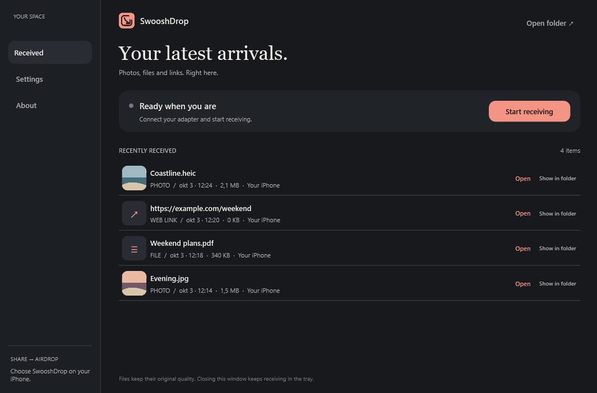
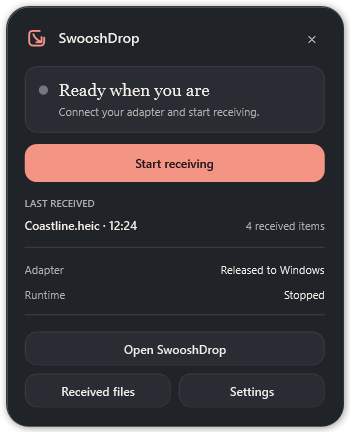
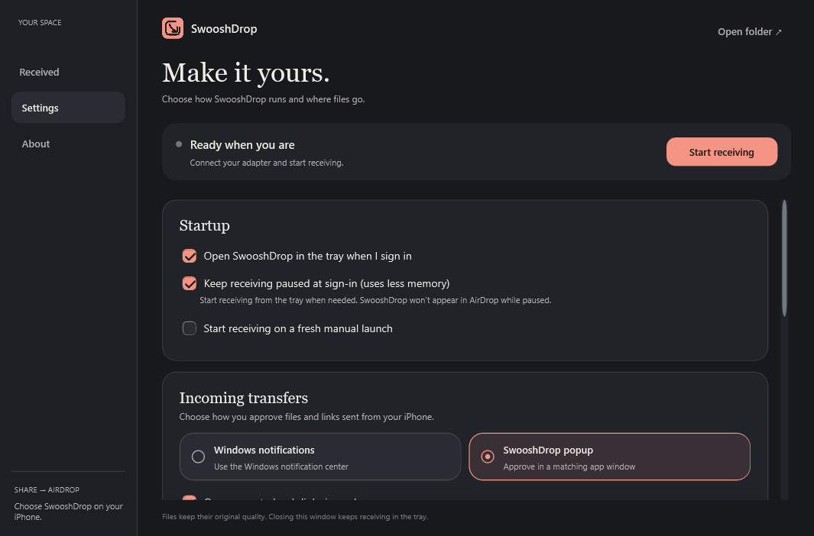

  

  Receive photos, files, and web links from your iPhone’s native <strong>Share → AirDrop</strong> menu on Windows. 
  No iPhone app needed.

  <a href="https://github.com/AlbinoPriest/swooshdrop/releases/download/v0.3.6/SwooshDropSetup.exe"><strong>Download the Windows beta ↗</strong></a>
  &nbsp; · &nbsp;
  <a href="docs/COMPATIBILITY.md">Check your adapter</a>
  &nbsp; · &nbsp;
  <a href="https://github.com/AlbinoPriest/swooshdrop/issues">Report an issue</a>

> **Hardware beta:** requires a compatible **dedicated USB Wi-Fi adapter**, WSL 2, and a separate internet connection. The tested adapter is the TP-Link TL-WN725N with USB ID `0bda:8179`. Other catalog entries are experimental. [Compatibility details →](docs/COMPATIBILITY.md)

## Your latest arrivals, in one place

**Preview of the current `main` branch**, using demo files and illustrative thumbnails. The Tempo Soft design, Through icon, and new tray behavior are included in source; the downloadable **0.3.6 beta** currently uses the earlier interface.

| From your iPhone | On your PC |
| :--- | :--- |
| **Photos & files** | Receive HEIC, PNG, documents, and other files. Browse the received list, open an item, or jump to its folder. |
| **Web links** | See the address before accepting. Accepted HTTP/HTTPS links can open in your default browser. |
| **Your approval** | Choose Windows notifications or a matching SwooshDrop popup. Every incoming transfer needs your approval. |
| **Your files, preserved** | SwooshDrop saves the received file stream without resizing or recompressing it. Your iPhone decides what it shares. |

## Small when you need it

<table>
  <tr>
    <td width="50%" valign="top" align="center">
      
      
<strong>A useful little tray panel</strong> Receiving controls, your latest arrival, and quick access to files and settings.

    </td>
    <td width="50%" valign="top" align="center">
      
      
<strong>A preview before you accept</strong> Check the sender, photo preview, or web address before receiving.

    </td>
  </tr>
</table>

In the current source build, the tray icon is a grey outline with a transparent background while paused or off, and a filled coral tile when the receiver is ready. The panel grows to fit longer status messages. Left-click opens the panel; double-click opens the app.

## Make it yours

  
<strong>See settings: startup, notifications, files, and diagnostics</strong>

   
  

- **Start with Windows**, with receiving enabled or paused until you need it.
- **Pick your approval style:** Windows notifications or the integrated SwooshDrop popup.
- **Choose your save folder** and whether accepted links open automatically.
- **Read live logs** in Settings, with Activity, Radio, and Bridge views.
- **Pause the receiver** to return the adapter to Windows and stop the dedicated Linux runtime. Other WSL distributions remain running.

Tempo Soft uses charcoal surfaces, soft coral accents, rounded controls, and editorial headings. Short hover, page, and popup animations respect Windows’ animation setting.

## Get your first drop

1. **Check your hardware.** Use a compatible dedicated USB Wi-Fi adapter, with Ethernet or a separate adapter for internet access.
2. **[Download the beta](https://github.com/AlbinoPriest/swooshdrop/releases/tag/v0.3.6)** and run `SwooshDropSetup.exe`. Check prerequisites, select your adapter, then install. Restart manually if setup requests it and rerun setup.
3. **Start receiving.** On your iPhone, turn on Wi-Fi and Bluetooth and choose AirDrop’s **Everyone for 10 Minutes** option.
4. **Share → AirDrop → SwooshDrop.** Check the preview and press **Accept** on your PC.

Fresh installations save to **Downloads\SwooshDrop**. Upgrades keep your chosen folder and history. Closing the main window leaves the tray app running. Unanswered approval requests expire after 55 seconds; sender display names are unverified.

## What you’ll need

| Requirement | Current beta |
| :--- | :--- |
| **Windows** | Windows 10 22H2 or Windows 11, Intel/AMD x64, virtualization, and WSL 2. Development testing has been on Windows 11. |
| **Wi-Fi hardware** | A compatible dedicated USB Wi-Fi adapter. **TP-Link TL-WN725N / `0bda:8179`** has passed iPhone transfers; hardware revisions can differ. |
| **Internet connection** | Ethernet or a separate Wi-Fi adapter. The AirDrop adapter is reserved while receiving. |
| **Initial setup** | Administrator access for prerequisites and USB sharing, internet access, and several GB of free space. Everyday receiving runs as your normal user. |

The adapter catalog includes **86 USB device IDs** with bundled Realtek and MediaTek drivers. All except the tested ID are experimental. Built-in PCI Wi-Fi, sharing Windows’ active Wi-Fi adapter, ARM/32-bit PCs, arbitrary adapters, and Contacts Only are unsupported.

This beta’s radio modules require **`6.18.33.2-microsoft-standard-WSL2`**. Setup checks the kernel version and creates its own `WinDropRuntime` distribution. The installer is approximately **256 MiB** and includes corresponding source materials; setup downloads Ubuntu and runtime packages separately.

**Still a beta.** Discovery can be intermittent. Fresh second-PC and Windows 10 installs, sustained throughput, Live Photos, metadata fidelity, and experimental adapters need more testing. Builds are unsigned. [What has been tested →](docs/VALIDATION.md)

## Explore the project

| Guide | What’s inside |
| :--- | :--- |
| [Adapter compatibility](docs/COMPATIBILITY.md) | Supported device IDs, tested hardware, and experimental drivers. |
| [Installation & updates](docs/DISTRIBUTION.md) | Setup, installation paths, removal, and WSL memory behavior. |
| [Development & builds](docs/DEVELOPMENT.md) | Building the Windows app, runtime, source payload, and installer. |
| [Validation](docs/VALIDATION.md) | Transfer tests, regression checks, and remaining limitations. |
| [Third-party notices](THIRD-PARTY-NOTICES.md) | Component licenses and retained upstream notices. |

Found a bug? [Open an issue](https://github.com/AlbinoPriest/swooshdrop/issues) with your Windows version, adapter USB ID, and what happened. Remove personal paths and transfer names before sharing logs.

## Built on open source

SwooshDrop’s Windows frontend, installer, and hardware integration are developed independently by **AlbinoPriest**. The AirDrop protocol implementation is adapted from [UvejsGj/WinDrop](https://github.com/UvejsGj/WinDrop), copyright 2026 Uvejs Gjelaj, under the MIT license. [OWL](https://github.com/seemoo-lab/owl) provides AWDL under GPL-3.0. Original copyright and license notices are retained.

Our [MIT license](LICENSE) covers our original work; bundled components retain their own licenses. Setup includes OWL, GPL kernel/driver modules, firmware, notices, and corresponding sources, installed under `Sources`. See [component notices](THIRD-PARTY-NOTICES.md) and [pinned revisions](source-versions.json).

**Unofficial community project.** SwooshDrop is not affiliated with, sponsored by, or endorsed by Apple, Microsoft, or the upstream WinDrop and OWL maintainers. AirDrop, iPhone, and Windows are third-party product names used to describe compatibility.
